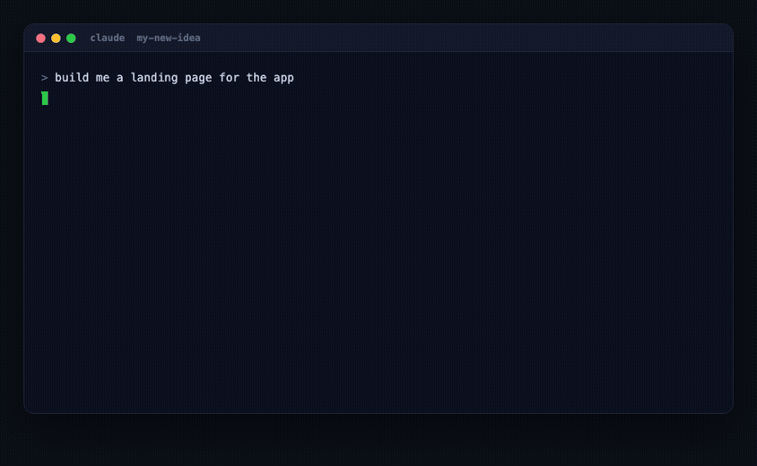
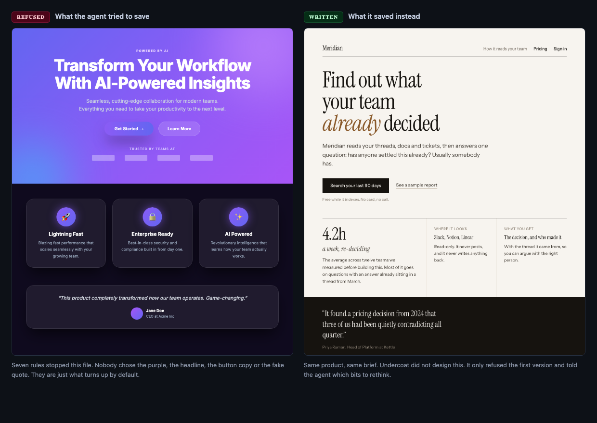
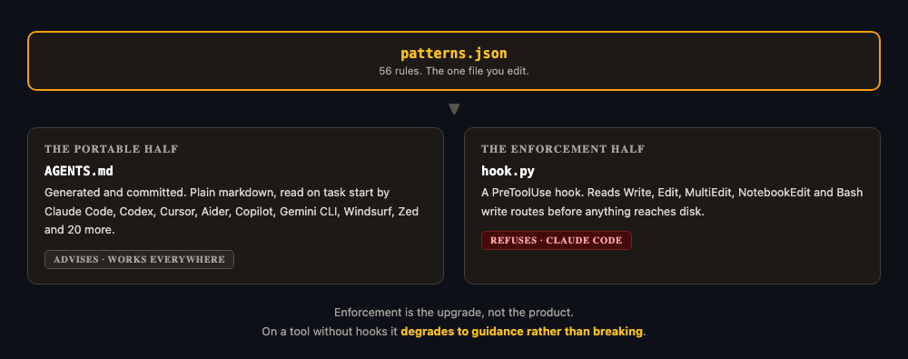

# Undercoat

**Stops your coding agent building the same generic page it builds for everyone else.**

You've seen this page. Everyone has.


Your agent didn't pick the purple, or the headline, or the button that says Get Started.
None of that was a decision. It's just what comes out when nothing tells the model
otherwise, because it's the average of every landing page it ever read.

You can tell it not to. That works for about forty files, and then it forgets.

Undercoat doesn't ask. It reads each file as the agent goes to save it, and if that stuff is
in there, the save just fails.



The agent reads the message and has another go. You don't get interrupted, and you never
see the first version.

## Install it

```bash
git clone https://github.com/jnemargut/undercoat
./undercoat/install.sh /path/to/your/project
```

That's the whole setup. The script tells you every change it makes as it makes it, backs up
your settings first, and `./undercoat/uninstall.sh` puts it all back.

If you'd rather have it on for everything you build without setting it up each time:

```bash
./undercoat/install.sh --global
```

Then `touch .undercoat.off` in any project you'd rather it left alone.

There's no account and no API key. It's Python and a couple of markdown files, same as
[decision-kit](https://github.com/jnemargut/decision-kit).

## What actually changes



Undercoat didn't design the page on the right. It only refused the one on the left and told
the agent which parts to think about again. The agent did the rest.

## How it works



You edit one file, `patterns.json`. Both halves come out of it.

**AGENTS.md** is plain markdown that most coding tools read on their own when they start a
task, so it works in Cursor, Codex, Copilot, Aider and a couple of dozen others. It can't
stop anything. It just tells the agent what to steer clear of.

**The hook** is the half that actually refuses, and it only works in Claude Code. It reads
every file the agent tries to save, before the file exists.

You get the advice everywhere and the refusal in Claude Code. If you've only got the first
one, nothing breaks.

It keeps an eye on shell commands too. An agent that can't use the save tool will happily
try `cat > file` instead, so Undercoat turns that down and points it back at the normal way.

## The rules

**72 of them. 34 refuse the file, 38 leave a note and let it through.**

<details>
<summary><strong>The 34 that refuse</strong></summary>

**Colour**

| Rule | What it catches |
|---|---|
| `ai-purple` | Purple, violet or indigo gradient stops |
| `ai-purple-hex` | The seven hex values models reach for when they mean "primary" |
| `rainbow-gradient` | Gradients with three or more colour stops |
| `tinted-shadow` | Coloured shadows like shadow-purple-500/50 |
| `gradient-on-root` | A gradient on the page background itself |

**Shadows, blur and shape**

| Rule | What it catches |
|---|---|
| `neon-glow` | Zero-offset box shadows used as a glow |
| `ambient-blur-orb` | The blurred colour blob floating behind a hero |
| `gradient-border-trick` | A 1px gradient wrapper faking a glowing border |
| `z-index-nuke` | Four-digit z-index values |

**Type**

| Rule | What it catches |
|---|---|
| `default-sans-inter` | Inter set as the typeface |
| `hero-italic-emphasis` | One italic word inside a hero headline |

**The template page**

| Rule | What it catches |
|---|---|
| `stat-row` | Three or more round, unsourced numbers in a row |
| `marketing-eyebrow` | Section labels like Features, Benefits, How it works |
| `hero-pill-badge` | A small rounded chip sitting above the hero headline |
| `testimonial-triplet` | Three quote cards in a row, each with a circle avatar and a job title |
| `card-icon-tile` | An icon in a tinted rounded square, on a card or above an empty state |
| `pricing-most-popular` | A Most popular badge on a pricing tier |
| `invented-faq` | A Frequently asked questions block |
| `repeated-cta` | The same button wording repeated down the page |
| `min-read-byline` | An X min read estimate in a byline |
| `related-reading` | A Related reading or You might also like block |
| `tip-callout` | A Pro tip or Worth knowing callout box |
| `checkmark-benefit-list` | Three or more identical tick icons beside short benefit lines |
| `setup-checklist` | A numbered Finish setting up checklist card |

**Words on the page**

| Rule | What it catches |
|---|---|
| `generic-cta` | Buttons saying Get Started, Learn More, Click Here |
| `vague-headline` | Headlines like "Transform Your Workflow" |
| `buzzword-copy` | Seamless, cutting-edge, revolutionary, game-changing |
| `lorem-ipsum` | Placeholder latin still sitting in a real component |
| `placeholder-copy` | Your Company, Text goes here, Replace this |
| `fake-testimonial` | John Doe or Acme Inc used as social proof |
| `ai-implementation-comment` | Comments like "// In a real implementation this would" |

**Pictures and icons**

| Rule | What it catches |
|---|---|
| `stock-placeholder-image` | Hot-linked Unsplash, placehold.co or picsum URLs |
| `generated-avatar-service` | Procedural avatars from dicebear or ui-avatars |
| `emoji-as-icon` | An emoji doing an icon's job in a heading or button |

</details>

<details>
<summary><strong>The 36 it only mentions</strong></summary>

Every one of these is a real tell, but each is also sometimes exactly right, so Undercoat
says something and gets out of your way.

**Colour**

| Rule | What it catches |
|---|---|
| `tailwind-default-blue` | bg-blue-500 or bg-blue-600 as the brand colour |
| `hardcoded-neutral-ramp` | Tailwind's slate, zinc, gray or stone ramps hardcoded as the palette |
| `default-grey-body` | Light grey body text on a light background |
| `pure-black-on-white` | Pure #000 text |
| `hardcoded-hex-in-markup` | Arbitrary hex values inline in class names |

**Shadows, blur and shape**

| Rule | What it catches |
|---|---|
| `glassmorphism` | Frosted glass via backdrop-blur |
| `default-heavy-shadow` | shadow-xl and shadow-2xl on ordinary cards |
| `uniform-bubbly-radius` | rounded-3xl on every surface |
| `ring-decoration` | Focus rings used as ornament |
| `border-and-shadow` | A border and a shadow doing the same job |

**Type**

| Rule | What it catches |
|---|---|
| `system-font-only` | The system stack as the only typographic choice |
| `all-bold` | font-bold repeated until nothing stands out |
| `eyebrow-label` | The tiny uppercase letterspaced kicker above a heading |
| `giant-hero-text` | text-7xl and above |

**Words on the page**

| Rule | What it catches |
|---|---|
| `exclamation-marketing` | Exclamation marks in interface copy |
| `trusted-by-logos` | A "Trusted by" logo strip |
| `powered-by-ai-copy` | Copy selling the tech instead of the benefit |

**Pictures and icons**

| Rule | What it catches |
|---|---|
| `sparkles-icon` | The sparkle or wand icon standing in for AI |

**Layout and spacing**

| Rule | What it catches |
|---|---|
| `three-card-grid` | Three equal cards as a page's main content |
| `nested-cards` | A card inside a card |
| `everything-centered` | Whole sections centre-aligned |
| `hero-icon-circle` | A big circled icon floating above a heading |
| `full-height-hero` | min-h-screen on the first thing anyone sees |
| `default-container-width` | max-w-7xl mx-auto, the width nobody picked |
| `sticky-everything` | More than one sticky element fighting for the screen |
| `status-chip-soup` | Four or more badges in one view |
| `cramped-padding` | p-0 and p-1 where something needed room |
| `magic-spacing` | Arbitrary pixel spacing off the scale |
| `small-touch-target` | Buttons under roughly 44px |
| `placeholder-as-label` | A placeholder doing the job of a label |
| `nothing-here-yet` | A No X yet or Nothing here yet empty state heading |

**Movement**

| Rule | What it catches |
|---|---|
| `uniform-fade-in` | The same entrance animation on everything |
| `bounce-easing` | Overshoot easing on interface motion |
| `decorative-pulse` | animate-pulse on something that isn't loading |
| `slow-transition` | Transitions over half a second |

**Everything else**

| Rule | What it catches |
|---|---|
| `dark-mode-reflex` | A near-black page background by default |
| `inline-style-attribute` | Values set inline, going round the system |
| `important-override` | !important |

</details>

### Why some refuse and some don't

A rule only gets to refuse a file if two things are true. What it looks for has to mean one
thing and nothing else, and almost nobody should ever want it on purpose.

Take a hot-linked Unsplash photo in shipped code. It means one thing, and almost nobody
wants it, so that one refuses. Three cards in a row is a genuine tell, but plenty of good
pages have three cards in a row, so that one just says something and moves on.

How many people agree a pattern is ugly doesn't come into it. The only question is whether
stopping you would ever be the wrong call.

## When a rule gets it wrong

Turn it off for that project:

```json
// .undercoat.local.json
{ "off": ["ai-purple"] }
```

One rule, one project. You can't skip a single line, and that's deliberate, because if you
could then the agent could write the skip itself and wave its own work through.

If a rule refuses the same file three times, Undercoat gives up and hands it to you rather
than letting the agent go round in circles.

## What it can't do

It reads text, and that's all it reads. So:

- **Layout is invisible to it.** Four identical sections stacked down a page sail straight
  through, and honestly that's where most of the "AI made this" feeling comes from.
- **It can't see colour in context.** Grey text is unreadable on white and completely fine
  on black, and the file looks the same either way.
- **It can't tell writing about a pattern from using one.** A style guide that mentions
  `from-purple-600` gets pulled up for it, so turn Undercoat off in those repos.

If you want something that looks at the finished page and tells you it's boring, you want a
design reviewer. Undercoat is built to work alongside one, not replace it.

## Does it get in the way?

I ran it over shadcn/ui, tailwindcss.com and cal.com, which is about 4,700 files of
carefully written code by people who know what they're doing. It refuses 0.3% of them now,
and most of those are fair.

That corpus decides things, and it is also how most of the rules got written. The loop is:
generate a page that already passes every rule, look at what is still wrong with it, turn
that into a rule, then measure the rule before it is allowed to refuse anything.

Sixteen rules came out of three rounds of that. It also cost one: `hardcoded-slate` used to
refuse, until widening it to zinc and gray showed that hardcoding neutral hexes is normal in
real code. It advises now.

The first version refused a third of tailwindcss.com, which was how I found out that five
rules were badly judged and several were far too broad.

The rules that refuse are all judgement calls about what nobody would want on purpose. If
one of them stops something you meant to write, I got that judgement wrong, and I'd like to
know.

## Credit

Most of these patterns were worked out by other people first. The rules here describe things
named by [impeccable](https://github.com/pbakaus/impeccable),
[Taste Skill](https://github.com/Leonxlnx/taste-skill) and
[Anthropic's frontend-design skill](https://github.com/anthropics/skills/tree/main/skills/frontend-design),
plus a handful of write-ups cataloguing AI design tells. There's a fuller note in `NOTICE`.

What's different here is when it happens. Other tools tell the agent what to do before it
starts, or check your code once it's finished. This one stops the file from being written
in the first place.

## Try it

Point it at whatever you're building next and see what it stops.

Then tell me what it got wrong. A rule that refuses something you actually wanted is worth
more to me than ten that fire correctly.

Apache-2.0. See `LICENSE` and `NOTICE`.
